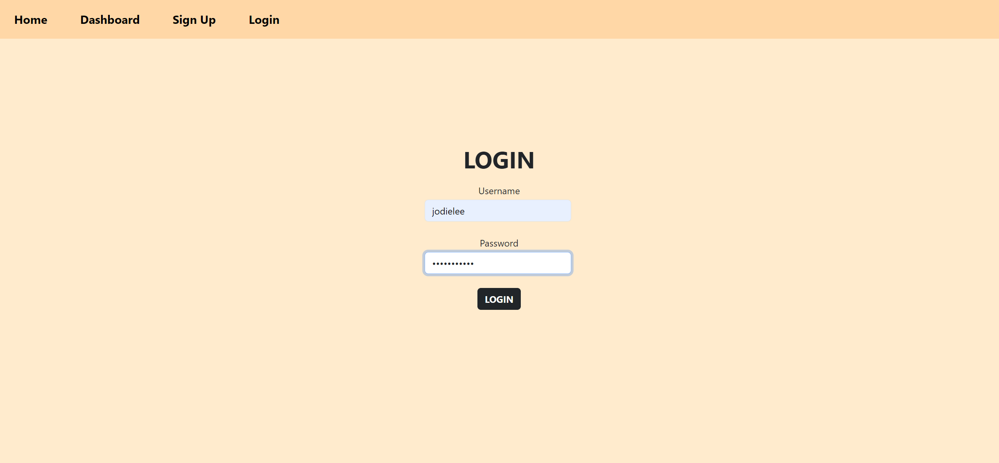

# Games Blog

[](https://opensource.org/licenses/MIT)

## Description

The Games Blog is a platform where users can share their favorite games, discuss gaming trends, and engage in conversations about various aspects of gaming culture. It allows users to publish blog posts and share their thoughts and opinions on different games and gaming experiences. The application follows the MVC architectural pattern, utilizing technologies such as Handlebars.js for templating, Sequelize as the ORM for database management, and express-session for user authentication.

The motivation behind the Games Blog is to create a community-driven platform for gamers to connect, share insights, and discover new games. By providing a space where users can publish their gaming-related content, the Games Blog aims to foster a vibrant community of gamers who can engage in meaningful discussions and stay updated on the latest gaming news and releases.

### Problem Solving

The Games Blog addresses the need for a centralized platform where gamers can express their passion for gaming, share their experiences, and interact with like-minded individuals. It provides a user-friendly interface for creating, editing, and deleting blog posts, as well as leaving comments on other users' posts. Through features such as user authentication and session management, the Games Blog ensures a secure and personalized experience for every user.

### Learning

By developing the Games Blog, the following learning objectives are achieved:

- Understanding the principles of MVC architecture and applying them to web development projects.
- Practicing the integration of Handlebars.js for dynamic content rendering and user interface design.
- Gaining proficiency in working with Sequelize as an ORM for database interactions and data modeling in a Node.js environment.
- Exploring user authentication mechanisms using express-session to authenticate and authorize users securely.

## Installation

To install and run this project locally, follow these steps:

1. Clone the repository to your local machine.
    
    git clone git@github.com:jodielee062788/mvc_techblog.git

2. Open the project folder in your code editor.

3. Install the necessary dependencies by running the command:

    ```npm install```
    
4. Set up the environment variables by creating a .env file and adding the following variables: DB_NAME, DB_USER & DB_PASSWORD.

5. Run the schema and seed commands to create and seed the database:

    ```source db/schema.sql```

    ```npm run seed```

6. Access the Games Blog application in your web browser at the specified port.

## Usage

1. Run the application using npm start

    ```npm start```

2. Upon accessing the homepage, users will see existing blog posts related to games. The homepage also features navigation links for accessing different sections of the site, such as the dashboard, sign up, and login pages. However, users must log in to view posts and interact with the site's features.

    

3. Users who do not have an account can sign up for one, while those with existing accounts can log in. The sign-up and login pages prompt users to provide their credentials securely.
 
    

    

4. After successful authentication, users are redirected to the dashboard. Here, users can view their existing blog posts and access various options for managing their content.

    

    

5. In the dashboard, users can perform actions such as adding new posts, viewing existing posts, editing posts, and deleting posts. Let's explore further by viewing a post authored by another user.

    

6. Users can engage with posts by posting comments. Each post displays comments from other users.

    

7. Users can contribute to the blog by adding new posts. After adding a new post, it will be immediately visible in the user's dashboard and homepage.

    

    

8. Users can edit their existing posts to keep them up-to-date or make revisions as needed.

    

    

9. If a user wishes to remove a post from the blog, they have the option to delete it from their dashboard.

    

    

## Live Demo - Heroku

Check out the live demo of Games Blog deployed on Heroku [here](https://games-blog-810710186486.herokuapp.com/).

## Credits

Visit my github to see all my works and projects. Feel free to contact me if you have any questions through my email: jodielee062788@gmail.com

## License
This project is licensed under the MIT License - see the [LICENSE](./LICENSE) file for details.

## How to Contribute

If you'd like to contribute to this project, please follow these guidelines:

1. Fork this project.
2. Create a new branch for your feature or bug fix.
3. Commit your changes.
4. Submit a pull request.


